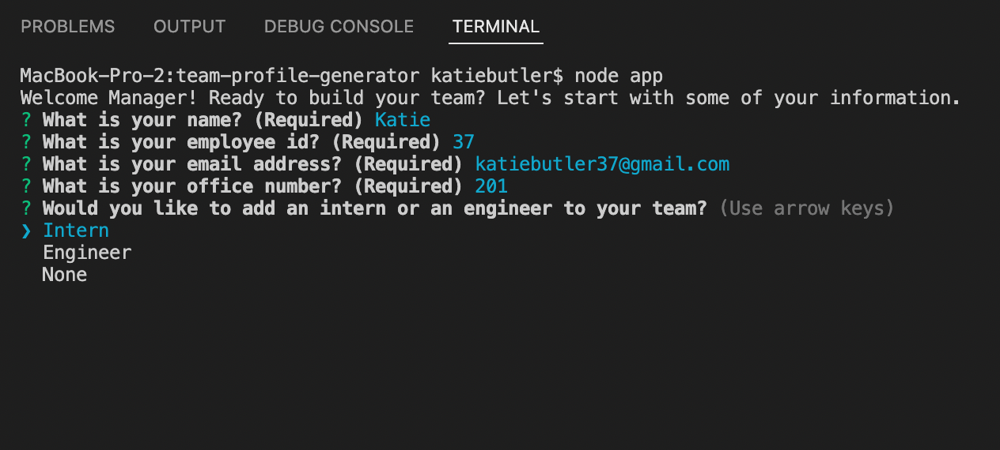
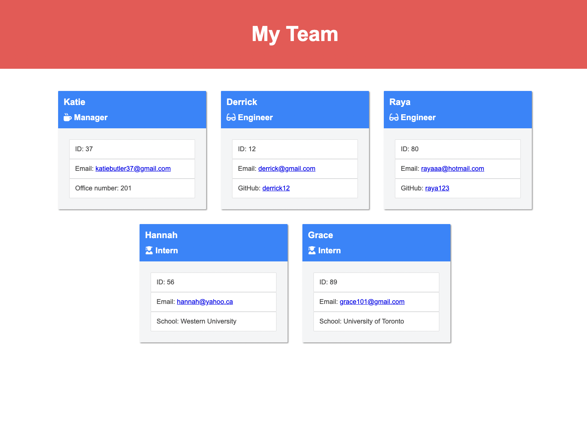

# Team Profile Generator

  ## Table of Contents
  1. [Description](#description)
  2. [Installation](#installation)
  3. [Usage](#usage)
  4. [License](#license)
  5. [Contributing](#contributing)
  6. [Tests](#tests)
  7. [Questions](#questions)
   
## Description
- The motivation for creating this repository was to allow managers to build a webpage of their team by inputting their information in the command line.
- This application helps to save time while creating a professional display to organize employee information.
- While creating this application, I was able to apply existing knowledge of Node.js, Inquirer and template literals in JavaScript, focusing on using Object Oriented Programming and Test Driven Development.
   
## Installation
To install the project repository, please follow these steps:
1. Clone my repository to your own on your local device.
2. Navigate into the repository root directory.
3. Enter ```npm install ``` into the command line to get access to all the necessary node modules.

## Usage
To get started building your professional team with the Team Profile Generator...
1. Open the repository and complete installation instructions.
2. Enter ```node app ```into the command line terminal.
3. Follow all prompt instructions to answer the questions carefully.
4. After the final question is answered, go into the "dist" directory to find your newly generated index.html!
5. Adjust as desired for further customization.
6. Copy the file along with its CSS stylesheet and add it wherever you'd like!




 
## License
This project is not licensed.

## Contributing
There are no additional contributors to credit beyond the repository owner for this project.

If you would like to this repository, please first discuss the change you wish to make via issue, email, or any other method with the owner of this repository before making a change. Only respectful engagement with this repository will be tolerated to foster an open and welcome environment.
  ### Pull Request Process
  - Pull requests will be merged upon approval of the repository owner.

## Tests
Run the following command in terminal to test the functionality of this application:

```sh 
npm run test
```
 
## Questions
If you have any questions about this project repository, please feel free to contact its owner.
  #### GitHub: [katiebutler37](https://github.com/katiebutler37)
  #### Email: [katiebutler37@gmail.com](mailto:katiebutler37@gmail.com)

    
